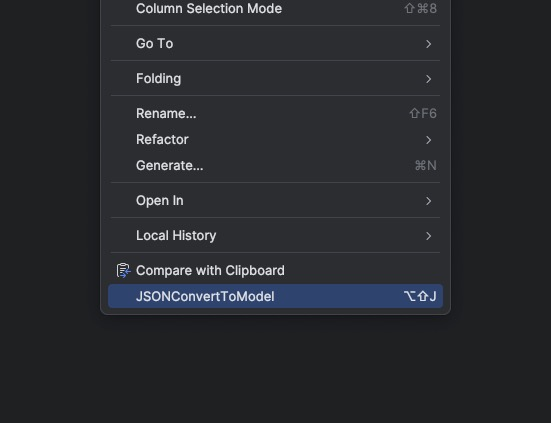
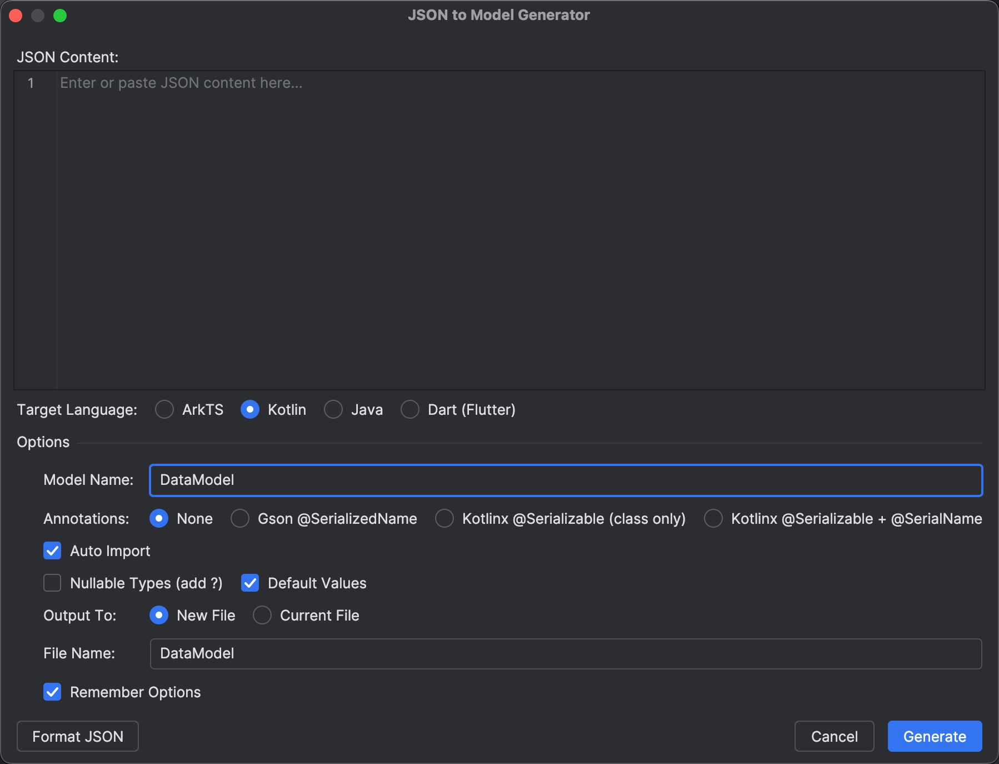
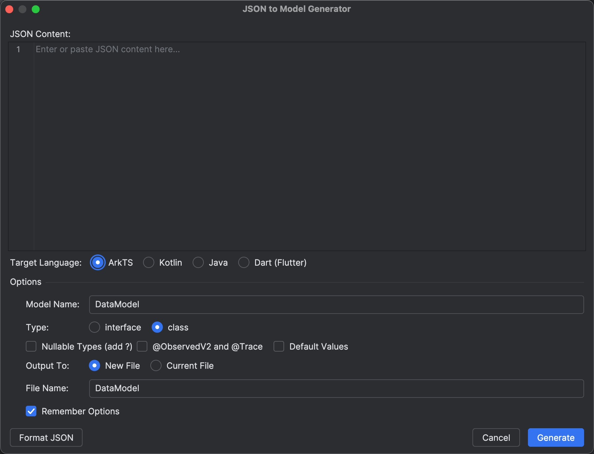
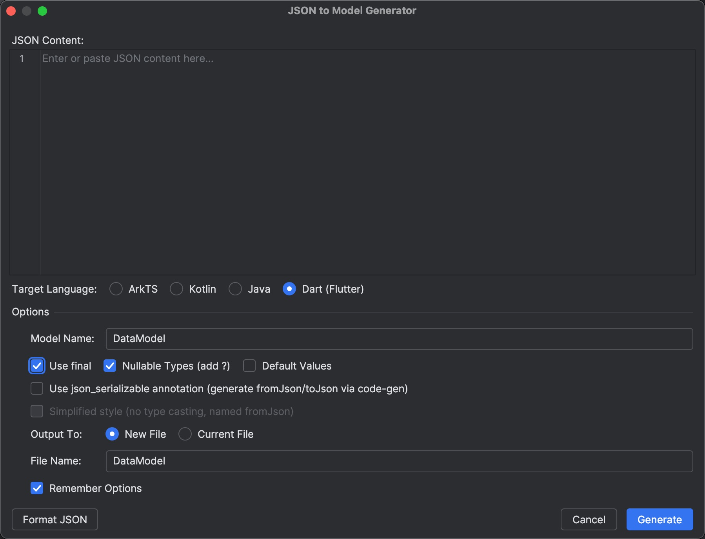

# JsonConvert

An IntelliJ / Android Studio / DevEco Studio plugin that converts JSON into model classes on the fly.

It turns JSON into **ArkTS / Kotlin / Java / Dart (Flutter)** model classes in one click — infers types, handles nested objects, and can output to a new file or the current file. Also works in DevEco Studio for HarmonyOS (ArkTS) development.

---

## Usage

1. Right-click in the editor and choose **JSONConvertToModel** (default shortcut `⌥⇧J` / `Ctrl+Alt+J`).

   

2. Paste your JSON in the dialog, pick the target language and options, then click **Generate**.

   

---

## Supported Languages & Options

### ArkTS

- Generate `interface` or `class`
- Nullable types (`?`), `@ObservedV2` / `@Trace`, default values

  

### Kotlin

- Annotations: `None` / `Gson @SerializedName` / `Kotlinx @Serializable`
- Nullable types, default values, auto import

### Java

- `Gson @SerializedName`, auto import, generate get/set methods

### Dart (Flutter)

- `final` fields, nullable types, default values
- Official `json_serializable` style or a simplified custom style

  

---

## Output

- **New File**: generates a new file using the `File Name`
- **Current File**: inserts the result into the currently open file
- Tick **Remember Options** to persist the current choices

---

## Build & Run

```bash
./gradlew buildPlugin    # package the plugin, output in build/distributions/*.zip
./gradlew runIde         # launch a sandbox IDE for debugging
./gradlew verifyPlugin   # plugin compatibility verification
```

The plugin is compatible with IntelliJ Platform `243+` (IDEA 2024.3), Android Studio, and DevEco Studio.

---

## Notes

- For development / extension details, see [JsonConvert_开发指南.md](JsonConvert_开发指南.md) (Chinese).
- Nested objects are extracted into sub-models; name collisions are resolved by appending an index.
- On parse failure the result contains a `// Parse Error: ...` comment instead of crashing the IDE.

---

## Environment

- IntelliJ Platform Gradle Plugin 2.7.1
- Kotlin 2.1
- IDEA IC 2024.3 (also works on DevEco Studio)
- Version: 1.0.2
